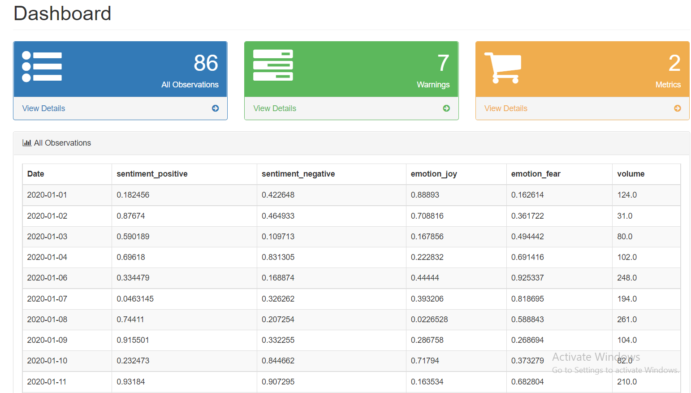
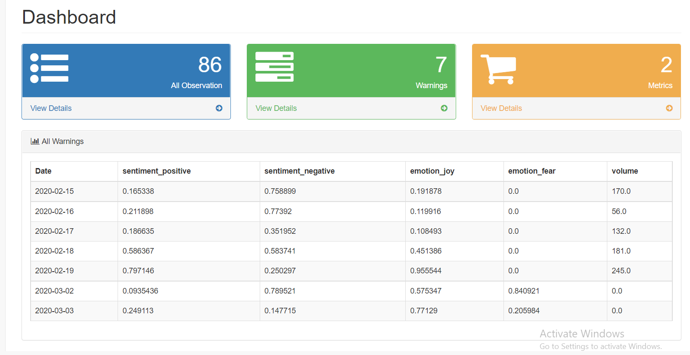
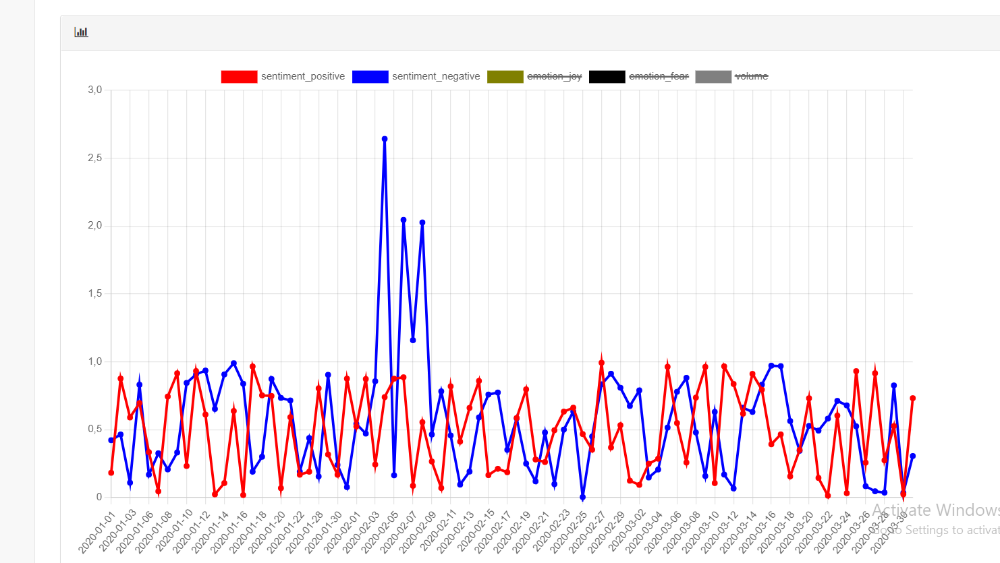
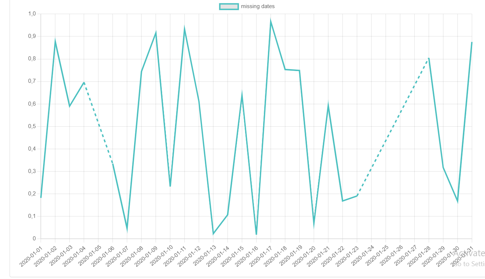

# Data Visualisation Dashboard Using Chart.js

**Task** : Build an interface to interact and analyze a time-series data file looking for issues.

## Using the dashboard we can :

● Display the data file 

● Check missing lines (non contiguous time-series)

● Visualize the distrubution of each attribute of the data

● Check  0s in the columns (which could be a warning rather than an error)

